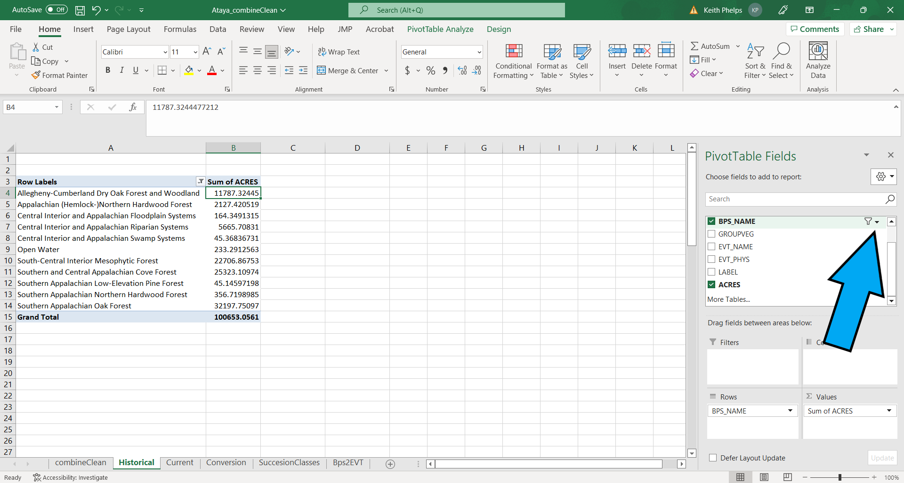
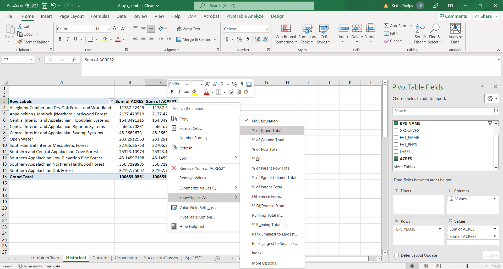

# Historical Ecosystems

In this section we will learn which ecosystems and their extent on our landscape historically. Before we begin, let's review our BpS GIS map and draw some quick visual conclusions:

```{r BpsFigure, echo=FALSE, out.width='1000pt'}
knitr::include_graphics("KP_GISmaps/Ataya_bps.png")

```

According to LANDFIRE, most of Ataya was dominated by:

* Southern Appalachian Oak Forest
* Southern and Central Appalachian Cove Forest
* South-Central Interior Mesophytioc Forest 

We can also see that most of the Southern Appalachian Oak Forest and Cove Forest is confined to the southwest portions of the Study Area. In contrast, South-Central Interior Mesophytic Forests are more prevalent in the northern portions of the Study Area. Ok- let's move on! 

## General Methods

In this section, and most others following, we will depend on "Pivot Tables" in Excel. These are powerful (for better or worse!) tools that allow for tasks such as:

* Organization and formatting of data.
* Calculations.
* Filtering data.
* Nesting data.

With the power comes the call for caution.  It is very easy to display values that look illuminating- but may be wrong. You can easily be duped into complacency, especially when working in the "value field settings."

### Some Potential Traps with Pivot Tables

Pivot Tables allow you to calculate, summarize, format and analyze datasets. These are a few traps we run into frequently which are worth mentioning here:

* **Your Pivot Table controls go away**.  This happens when you click outside of the main Pivot Table area (where your values are, usually on the left side of screen).  To fix this click inside one of the Pivot Table columns.  Another way to fix this is to right click inside a Pivot Table cell and select "Show field list". 
* **Miscalculating.**  This typically happens when you are in the "Value Field Settings" pane and select the wrong "Show values as" option.  The key here is to visually inspect the results to make sure you have made the correct selection.
* **You want to remove totals and subtotals without having to delete them all.** To fix this and many formatting issues click anywhere inside of the Pivot Table -> Click "Design" from the top ribbon -> click the "Subtotals" drop down -> click "Do Not Show Subtotals".  Repeat for Grand Totals.  While you are there, explore the Report Layout and Blank Rows drop downs.


## Getting at amounts of historical ecosystems

**Start by opening the "Historical" tab in the Excel workbook ("combineClean").**  

1. In the Pivot Table Fields pane, select "BPS_NAME" then "ACRES".  
2. Right click in the top cell of the "Sum of ACRES" column (not the column header) in the Pivot Table, then "Sort Largest to Smallest".

```{r bps1, echo=FALSE, out.width='750pt'}
knitr::include_graphics("Excel_screenshots/BPS_first.png")

```

3. In our example we have some BpSs that have low ACRES values. We can do a little formatting/cleaning before making a chart:
    * To remove BpSs from the table you will click the drop-down menu to the right of "BPS_NAME" in the Pivot Table Fields pane.  You can uncheck BpSs as appropriate.
    
```{r bps2, echo=FALSE, out.width='750pt'}


```
    
It is also possible to filter by right clicking on the top value in the list of BpSs, then selecting Filter > Top 10....  Once in that menu you can refine the filtering.

4. To get percentages, drag "ACRES" from the top Pivot Table Field pane to the "Values" pane. This will add a second "ACRES" column to the table. Right click in the second instance of "ACRES" (reads "SUM of ACRES2" in our example) to open up a drop down menu, then navigate to Value Field Settings. In this menu select the "Show Values As" tab, click the "Show Values As" drop down then select "% of Grand Total% to get percentages of each BpS (make sure that "BPS_NAME" is selected as the "Base field").  

```{r bps3, echo=FALSE, out.width='750pt'}


```

5.  To get a "running total" of percentages you will add a third instance of "ACRES" to the "Values" pane, then navigate to Value Field Settings.  In this menu select the "Show Values As" tab, click the "Show Values As" drop down then select "% Running Total In" to get running totals of  percentages of each BpS (make sure that "BPS_NAME" is selected as the "Base field"). 
6. Save!


**Example output**

Below is essentially the output from our Pivot Table work with a couple changes:

* Names have been shortened for ease of reading.
* Numbers have been rounded.

```{r bpsDT, echo=FALSE, message=FALSE, warning=FALSE}
library(DT)
library(readr)
bps <- read_csv("AtayaData/bpsAtaya.csv")


datatable(head(bps), 
          class = 'cell-border stripe', 
          options = list(scrollX  = TRUE, pageLength = 5)) %>%
  formatRound(c("ACRES", "PERCENT", "RUNNING_PERCENT"), 0)

```

<br>
<br>

We see that the top 3 BpSs comprised ~80% of our example landscape historically. We can visually confirm this and other patterns with a quick chart made in R (similar charts available in Excel by highlighting the data, clicking Insert then selecting the chart type in the "Charts" tab):

<br>

```{r bpsChart, echo=FALSE, message=FALSE, warning=FALSE}
library(ggplot2)
library(scales)

ggplot(bps, aes(x = reorder(BpS, ACRES), y = ACRES)) + 
  geom_bar(stat = "identity", fill = "grey31") +
  coord_flip() +
  labs(x = "", 
       y = "Acres", 
       title = "Historical Ecosystems of Ataya",
       caption = "From LANDFIRE Biophysical Settings data. Names shortened for clarity.",
       colour = "black") +
  scale_y_continuous(labels = comma) +
theme(plot.title = element_text(size = 15), axis.title = element_text(size = 13), panel.grid.major = element_blank(), panel.grid.minor = element_blank(),
        panel.background = element_blank(), axis.line = element_line(colour = "black")) +
    theme(plot.caption = element_text(hjust = 0, face= "italic"), #Default is hjust=1
        plot.title.position = "plot", #NEW parameter. Apply for subtitle too.
        plot.caption.position =  "plot")
```


