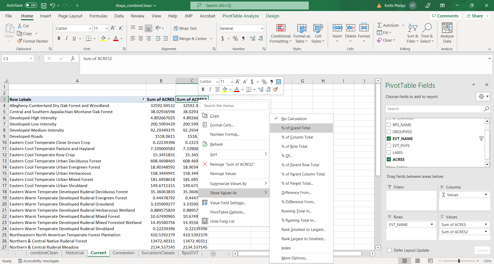

# EVT Data

## Existing Vegetation Types

While looking at the historical ecosystems gives context, we also need to get a picture of which ecosystems are on the landscape today. Like the last section, let's first take a look at our EVT GIS Map generated using [LANDFIRE's Existing Vegetation Type (EVT)](https://www.landfire.gov/evt.php) data:

<br>

<!-- removed quotation mark and added a vertical space -->

```{r EvtFigure, echo=FALSE, out.width='1000pt'}
knitr::include_graphics("KP_GISmaps/Ataya_evt.png")

```

<br>

As we can see, there are FAR more ecosystem types present in Ataya today. In the map we see that there is far more Allegheny Dry Oak Forest/Woodland, Northern and Central Native Ruderal Forest, and recently logged cover. This map is certainty different from our Bps map! Let's move on... 

## Getting at Amounts of Current Ecosystems


We use the same general methods as we did on the "Historical Ecosystems" page, as we will be using another Pivot Table.

<br>

<!-- KEITH INSERT SCREENSHOT AFTER #S 2, FIRST BULLET OF 3 (?) AND 4 (?).   -->

<!-- KEITH THERE ARE SOME REFERENCES TO 'BPS' BELOW-CHANGE TO 'EVT' -->

**Start by opening the "current" tab in the Excel workbook.**

1. In the Pivot Table Fields pane, select "EVT_NAME" then "ACRES".  Make sure that EVT_NAME is in the "Rows" pane, and that "Sum of ACRES" is in the "Values" pane.  
2. Right click in the top cell of the "Sum of ACRES" column (not the column header) in the Pivot Table, then "Sort Largest to Smallest". 

```{r evt1, echo=FALSE, out.width='750pt'}
knitr::include_graphics("Excel_screenshots/EVT_first.png")

```

3. In our example we have some EVTs that have low ACRES values. We can do a little formatting/cleaning before making a chart:
    * To remove EVTs from the table you will click the drop-down menu to the right of "EVT_NAME" in the Pivot Table Fields pane. You can now uncheck EVTs as appropriate.
    
```{r evt2, echo=FALSE, out.width='750pt'}
knitr::include_graphics("Excel_screenshots/EVT_second.png")

```
    
It is also possible to filter by right clicking on the top value in the list of EVTs within the Pivot Table, then selecting Filter > Top 10....  Once in that menu you can refine the filtering.
    * Additionally, we would like to add commas and remove decimal places. To do this right click the row that contains "Sum of ACRES" in the spreadsheet (likely row "B"), select "Format Cells" > Number > set Decimal places to "0" then check the "Use 1000 Separator box.
    
4. To get percentages, drag "ACRES" from the top Pivot Table Field pane to the "Values" pane.  This will add a second "ACRES" column to the table. Right click to open up the drop down in the second instance of "ACRES" (reads "SUM of ACRES2" in our example), then navigate to Value Field Settings. In this menu select the "Show Values As" tab, click the "Show Values As" drop down then select "% of Grand Total% to get percentages of each EVT (make sure that "EVT_NAME" is selected as the "Base field").  

```{r evt3, echo=FALSE, out.width='750pt'}


```

5.  To get a "running total" of percentages you will add a third instance of "ACRES" to the "Values" pane, then Value Field Settings.  In this menu select the "Show Values As" tab, click the "Show Values As" drop down then select "% Running Total In" to get running totals of  percentages of each EVT (make sure that "EVT_NAME" is selected as the "Base field"). 
6. Save!


**Example output**

Below is essentially the output from our Pivot Table work with a couple changes:

* Names have been shortened for ease of reading
* Numbers have been rounded
* We have only included a selection of (5) EVTs

```{r evtDT, echo=FALSE, message=FALSE, warning=FALSE}
library(DT)
library(readr)
evt <- read_csv("AtayaData/evtAtaya.csv")


datatable(head(evt), 
          class = 'cell-border stripe',
          options = list(scrollX  = TRUE, pageLength = 5))%>%
  formatRound(c("ACRES", "PERCENT", "RUNNING_PERCENT"), 0)
```

<br>
<br>

We see that first there are many EVT's. This is partially due to the addition of Developed and other "modern" categories such as "Recently Logged-Tree Cover". Second we see that of the "natural" types there are some important changes from historic ecosystem conditions. In Ataya, there is currently far more acreage associated with Allegheny Dry Oak Forest/Woodland. We can visually confirm this and other patterns with a quick chart made in R (similar charts available in Excel by highlighting the data, clicking Insert then selecting the chart type in the "Charts" tab):

<br>

```{r evtChart, echo=FALSE, message=FALSE, warning=FALSE}
library(ggplot2)
library(scales)
library(dplyr)

evt %>%
  top_n(10, ACRES) %>%
ggplot() +
  aes(x = reorder(EVT, ACRES), y = ACRES) + 
  geom_bar(stat = "identity", fill = "grey31") +
  coord_flip() +
  labs(x = "", 
       y = "Acres", 
       title = "Current Ecosystems of Ataya",
       caption = "From LANDFIRE Existing Vegetation Type data. Names shortened for clarity",
       colour = "black") +
  scale_y_continuous(labels = comma) +
theme(plot.title = element_text(size = 15), axis.title = element_text(size = 13), panel.grid.major = element_blank(), panel.grid.minor = element_blank(),
        panel.background = element_blank(), axis.line = element_line(colour = "black")) +
    theme(plot.caption = element_text(hjust = 0, face= "italic"), #Default is hjust=1
        plot.title.position = "plot", #NEW parameter. Apply for subtitle too.
        plot.caption.position =  "plot")
```


