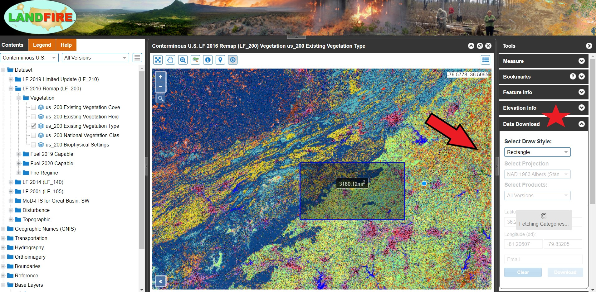
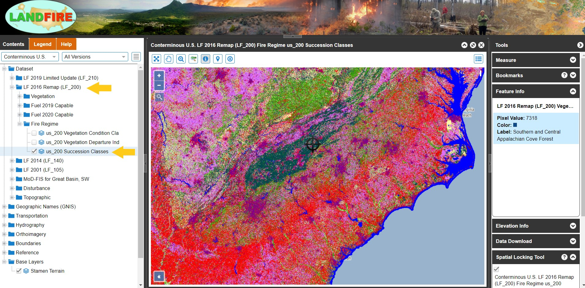

# APPENDIX 

## LANDIFRE Data Downloading Help 

**LANDFIRE Data Download Homepage**

1. LANDFIRE 2016 EVT data will be the default display.
2. You can turn off EVT layers and find different data layers on the left hand column. 
3. Regions and bookmarks can be found/made on the right. 

```{r LANDFIRE1, echo=FALSE, out.width=1000}
knitr::include_graphics("KP_screenshots/LANDFIRE First Load.jpg")

```

**LANDFIRE Identify Tool**

1. Click where the red arrow is pointing. 
2. This will allow you to ID layers you have selected. Your query will be displayed in the right hand column (under "Feature Info"). 
3. We see that we have clicked on "Southern and Central Appalachian Cove Forest" from our EVT layer.

```{r LANDFIRE2, echo=FALSE, out.width=1000}
knitr::include_graphics("KP_screenshots/LANDFIRE Identify.jpg")

```

**LANDFIRE Data Download Tool**

1. In the right-hand column, expand the "Download Tool" (where the red star is located).
2. Click on the Blue Download Tool Icon in the toolbar.
3. Select "Rectangle" where the red arrow is pointing. 
4. Draw a Study Area of your interest. 
5. Select your projection.
6. Select your data product. We highly recommend TIFF with attributes (this will ensure the attribute table comes over with the raster).

```{r LANDFIRE3, echo=FALSE, out.width=1000}


```

**Download EVT Data**

1. Select the drop down menu for "LF 2016" on the left-hand column (first red arrow).
2. Click on us_200 Existing Vegetation Type (second red arrow).

```{r LANDFIRE4, echo=FALSE, out.width=1000}
knitr::include_graphics("KP_screenshots/LANDFIRE Find EVT.jpg")

```

**Download BpS Data**

1. Select the drop down menu for "LF 2016" on the left-hand column (first red arrow).
2. Click on us_200 Biophysical Settings (second red arrow).

```{r LANDFIRE5, echo=FALSE, out.width=1000}
knitr::include_graphics("KP_screenshots/LANDFIRE Find BpS.jpg")

```

**Download Sclass Data**

1. Select the drop down menu for "LF 2016" on the left-hand column (first yellow arrow).
2. Expand the "Fire Regime" folder beneath Fuel 2020 Capable (second yellow arrow).
3. Click on us_200 Succesion Classes. 

```{r LANDFIRE6, echo=FALSE, out.width=1000}


```


## Export "combine_studyArea" attribute table into an Excel Workbook

**Turn your GIS attribute table into an excel workbook and create your own pivot tables**

1. Locate the "Table to Table" tool in a geoprocessing search.
2. In inputs rows, select "combine_studyArea".
3. For the output location, save it to your project database.
4. For output name, type "Ataya_combineClean" (or your preferred name).

```{r GIS19, echo=FALSE, out.width=500}
knitr::include_graphics("04_gis_screenshots/19_table_table.png")

```

5. Run the tool. Once complete locate "Table to Excel".
6. For the Input Table, select the table we just created in our project database.
7. Navigate to an output folder location of your choosing. *Make sure to type ".xlsx" at the end of the file pathway. This will ensure your excel file is in the latest excel workbook format.*

```{r GIS20, echo=FALSE, out.width=500}
knitr::include_graphics("04_gis_screenshots/20_Table_Excel.png")

```

8. Click "Run" and open your table!
9. You can now clean up the data table by getting rid of unnessecary columns (OID, VALUE, BPS CODE, etc.)
10. To create pivot tables, select all columns and go to Insert -> Pivot Table -> New worksheet. 
11. Repeat step 10 for all the pivot table analyses you need. 