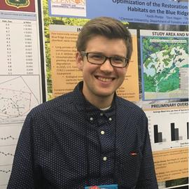

--- 
title: "LANDFIRE and Certified Sustainable Forest Management"
author: "Keith Phelps, Stacey Marion, and Randy Swaty"
date: "`r Sys.Date()`"
site: bookdown::bookdown_site
output: bookdown::gitbook
documentclass: book
biblio-style: apalike
link-citations: yes
description: "This is a TNC LANDFIRE GIS and excel tutorial to assist forest managers in FSC® audits"
always_allow_html: true 

output_dir: "docs"
---

# Overview {#Introduction}

In the following tutorial we explore the use of LANDFIRE data products in assessing forest ecosystem characteristics relevant to forest certification criteria.

Assessing forest condition in the context of ongoing forest management may include:

* Obtaining acres of ecosystems past and present
* Exploring ecosystem conversion
* Comparing amounts of succession classes past and present


## Forest Certification

Forest certification, in which third-parties audit forest operations to defined standards, is used as a tool to ensure forests are well-managed and provide confidence to consumers of forest products. Many of these standards include goals and requirements to manage and restore native ecosystems. One of these systems, the [Forest Stewardship Council®](FSC®) develops and delivers Principles, Criteria and Indicators for sustainable forest management (https://fsc.org/en/document-centre/documents/resource/392) through their national standards. Currently in the United States, FSC® Principles 6 and 9 are focused on Environmental Values and Impact and Maintenance of High Conservation Value Areas respectfully. In order for forest managers to receive FSC® certification and pass audits, many of the criteria and indicators within Principles 6 and 9 are helped by an analysis, often through a GIS assessment, of historical and current vegetation conditions, disturbance regimes, and landscape patterns.This analysis often delivers mapping and data that:

* Compares changes in composition and spatial patterns of historical and current ecological communities
* Assesses successional states of those ecosystems, past and present
* Documents the dominant natural disturbance regimes within ecosystems

These steps, while foundational and conceptually simple, can be difficult due to the lack of data, especially when pursuing them at a landscape scale. LANDFIRE data products and ecological models offer coverage of the conterminous United States, and are appropriate for large scale assessments when information is difficult or not attainable from ground surveys. The following guide provides procedures through which forest managers may be able to conduct analyses using LANDFIRE data. These procedures in turn could aid in standard conformance and leverage high-quality, open-source data to drive restoration on suitable sites. 

## LANDFIRE 

[LANDFIRE](https://landfire.gov/) is an interagency program within the United States that "provides 20+ national geo-spatial layers (e.g. vegetation, fuel, disturbance, etc.), databases, and ecological models that are available to the public for the US and insular areas." With this free and regularly updated data, it is possible to conduct analysis supporting environmental values and High Conservation Value Areas. In the following tutorial, we will provide guidance for:

* Downloading relevant LANDFIRE datasets and models
* Completing the GIS processing of LANDFIRE data
* Developing visuals (e.g., maps and charts) to help illustrate findings 

## GIS Tutorial Goals

In general the analyses developed here will help forest managers:

* Assess “representation” of ecosystems within ownerships and landscapes.
* Map ecosystems and their conditions past and present.
* Understand natural disturbance regimes and compare them to current landscape disturbance patterns.
* Explore ecosystem conversion both to unnatural (e.g., urban) land uses and different ecosystems.
* Provide context for where ecological restoration or conservation of current ecosystems should be prioritized on a landscape.  
* Assess site conditions that can be completed with existing datasets.
* Assess climate change and future condition considerations where possible with existing data.

In the United States, including the insular areas, [LANDFIRE](https://www.landfire.gov/) provides the datasets and ecological model results to get at these challenges and more. Here we walk you through some of the technical steps needed to start your analysis. We will do our work in a model landscape called the Ataya Forest Tract (hereafter referred to as "Ataya"). Ataya is managed by The Nature Conservancy (TNC) under FSC® standards (FSC®C008922) and is located in the Central Appalachians (highlighted in green in map below).

To help you with the concepts we have worked through pre-processed LANDFIRE data for this example landscape. To prepare the datasets for your own landscape, you may download the relevant LANDFIRE data for your own landscape and follow our steps.

**ZOOM, pan, explore the Ataya Forest Tract area**

```{css, echo=FALSE}
# p {
#   font-family: Tahoma, Verdana, sans-serif;
#   font-size: 15px;
#   letter-spacing: 1.2px;
# }
# ```
# 
# ```{css, echo=FALSE}
# h1 {
#   font-size: 32px;
#   font-family: Tahoma, Verdana, sans-serif;
# }
# ```
# 
# ```{css, echo=FALSE}
# .boldTitle {
#   font-size: 20px;
#   font-family: Tahoma, Verdana, sans-serif;
# }
# ```
# 
# ```{css, echo=FALSE}
# .list {
#   font-size: 14px;
#   font-family: Tahoma, Verdana, sans-serif;
#   letter-spacing: 1.1px;
# }
```

```{r loadshp1, message=FALSE, warning=FALSE, include=FALSE}
library(raster)
library(leaflet)
library(sf)

ataya <- st_read("AtayaData/Ataya .shp")
ataya <- st_transform(ataya, CRS("+proj=longlat +datum=WGS84 +ellps=WGS84 +towgs84=0,0,0"))

```

```{r leafletAtaya, echo=FALSE, message=FALSE, warning=FALSE}

leaflet(data = ataya) %>% 
  addTiles() %>% 
  addPolygons(fill = FALSE, stroke = TRUE, color = "#193b22")

```

=======

## Author Bios 

```{r Keith, echo=FALSE, out.width='250pt'}


```

**Keith Phelps**

Keith Phelps was born in St. Paul, MN and gained an appreciation for forests growing up exploring the banks of the Mississippi River and canoeing in the Boundary Waters. After graduating from UW Madison in History and Environmental Studies, Keith worked in the private sector of ecological restoration in the greater Madison and Driftless Region of WI. Here he gained an appreciation for plant conservation, prescribed fire, invasive species management, and urban restoration projects. After working in the UW-Arboretum Longnecker Horticultural gardens, Keith received his MS in Forest Resources at Clemson University. His research focused on developing GIS land suitability models for mechanized timber harvesting and prescribed fire restoration in the Southern Blue Ridge Escarpment of SC. Keith now works in ecological restoration and wetland delineation/determination in WI and continues to research forest restoration and management with GIS applications. In his free time, Keith enjoys running, making music, writing poetry, and going for hikes in WI.

```{r Stacey, echo=FALSE, out.width='250pt'}
knitr::include_graphics("KP_screenshots/stacey_headshot.png")

```


**Stacey Marion**

Stacey is an ecologist on a mission to advance conservation and land use projects using spatial analysis and visualization. She was raised in northern Connecticut where she was incredibly fortunate to grow up adjacent to a protected wetland, i.e. “the wet area”, that backed up to foothills of the Farmington Valley rift. Her early experiences bounding on tussock sedges, searching for salamanders under logs, taking spring ephemeral and rhododendron walks, and racing her sister up the ridge had a lasting imprint on her personal and professional life.

Early in her career she pursued organic farming and agricultural sciences, a pursuit that brought her from upstate New York to Madison, Wisconsin. After working in agricultural sciences, she was pulled back by the allure of natural plant communities and transitioned to a career in ecological restoration.

As a Restoration Ecologist, she developed and implemented science-based ecological restoration in southwest Wisconsin, where she developed an intimate relationship with the land, especially prairies, wetlands, and woodlands. She was a Board member on the Wisconsin Prescribed Fire Council where she helped implement prescribed fire-related policy.

In advancing her GIS, programming, and design skills through an M.S. in GIS and Cartography at UW-Madison (2021), she now explores human-land use interactions from a geographer’s view. She currently works as a GIS Analyst at HDR, Inc. in Seattle, Washington. She ultimately hopes to inform conservation policy through analytics and science communication.

She currently lives in North Bend, Washington where she spends her time outside of work on the trails running, skiing, or simply enjoying the awe of nature.

Link to resume: http://staceymarion.com/index.html
Social media: https://www.linkedin.com/in/stacey-marion ; https://www.instagram.com/stacemarion/


```{r Randy, echo=FALSE, out.width='250pt'}
knitr::include_graphics("KP_screenshots/Swaty.JPEG")

```


**Randy Swaty**

Randy Swaty is an Ecologist for [The Nature Conservancy’s LANDFIRE team](https://www.conservationgateway.org/conservationpractices/firelandscapes/landfire/pages/landfire.aspx) and co-lead of the [Conservation Data Lab](https://conservationdatalab.org/). He uses his ecological knowledge and programming expertise to assist natural resource professionals seeking the best data to support their work. His work has ranged from supporting mycorrhizal fungi experts to map potential fungal communities ([see Swaty et al., 2016](https://www.sciencedirect.com/science/article/pii/S1754504816300484#!)) to developing a template for forest professionals to follow when preparing for forest certification audits. Randy's accomplishments include the publication of multiple peer-reviewed publications and participation in numerous professional presentations but most of all, Randy enjoys connecting with natural resource professionals and helping them find ways to best leverage the power of LANDFIRE data to advance and amplify their work.

